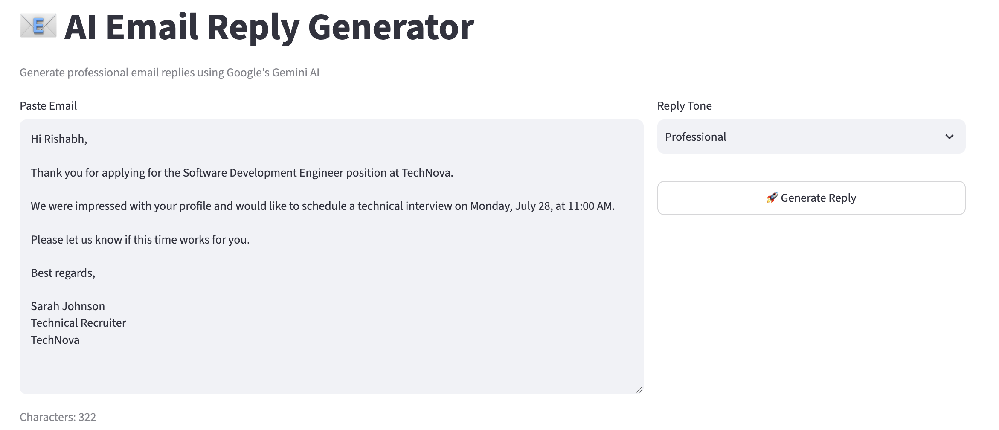
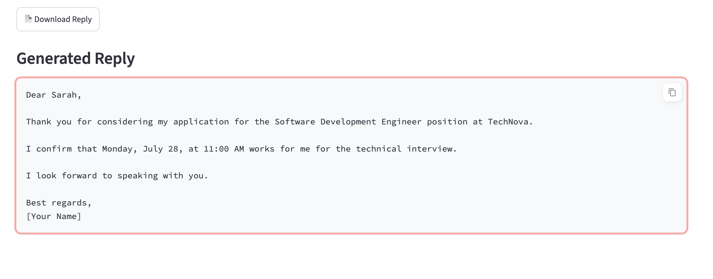

# 📧 AI Email Reply Generator

An AI-powered web application that generates context-aware email replies using Google Gemini AI, FastAPI, and Streamlit. The application helps users quickly draft professional, friendly, formal, HR, or customer support email responses while while automatically improving grammar and maintaining an appropriate communication tone.

⸻
## 🌐 Live Demo

🚀 Frontend Application:
https://ai-email-reply-generator-9ptfwbteg63w7fbwxtj5jo.streamlit.app/

⚡ Backend API:
https://ai-email-reply-generator-b2bk.onrender.com/

📚 API Documentation:
https://ai-email-reply-generator-b2bk.onrender.com/docs

🚀 Features

* Generate AI-powered email replies
* Multiple reply tones
    * Professional
    * Friendly
    * Formal
    * HR
    * Customer Support
* FastAPI REST API backend
* Streamlit interactive frontend
* Secure API key management using environment variables
* Modular project architecture
* Input validation using Pydantic
* Download generated reply as a text file

⸻

🛠️ Tech Stack

Backend

* Python
* FastAPI
* Uvicorn
* Pydantic

Frontend

* Streamlit

AI

* Google Gemini API
* Prompt Engineering

Tools

* Git
* GitHub
* VS Code
* REST API
* JSON
* python-dotenv

⸻

📂 Project Structure

## 📂 Project Structure

```text
AI-Email-Reply-Generator
│
├── backend
│   └── app
│       ├── models
│       ├── prompts
│       ├── routes
│       ├── services
│       ├── utils
│       ├── config.py
│       └── main.py
│
├── frontend
│   └── app.py
│
├── screenshots
│   ├── home.png
│   └── generated_reply.png
│
├── README.md
├── requirements.txt
└── .gitignore```

Create a .env file inside backend directory.

⸻

⚙️ Architecture

                 User
                   |
                   ▼
          Streamlit Frontend
                   |
             REST API Request
                   |
                   ▼
            FastAPI Routes
                   |
                   ▼
          Email Generation Service
                   |
                   ▼
          Prompt Engineering
                   |
                   ▼
          Google Gemini API
                   |
                   ▼
          Generated Reply


⸻

📸 Screenshots

Home Screen



⸻

Generated Reply




⸻

🧠 API Endpoint

Generate Email Reply

POST /generate

Request

{
  "email": "Hi, can we schedule the interview tomorrow at 11 AM?",
  "tone": "Professional"
}

Response

{
  "reply": "Dear HR Team,\n\nThank you for reaching out..."
}

⸻

💻 Installation

Clone Repository

git clone https://github.com/rishabhgandhi1/AI-Email-Reply-Generator.git

⸻

Navigate to Project

cd AI-Email-Reply-Generator

⸻

Create Virtual Environment

Windows

python -m venv .venv
.venv\Scripts\activate

macOS/Linux

python3 -m venv .venv
source .venv/bin/activate

⸻

Install Dependencies

pip install -r requirements.txt

⸻

Configure Environment Variables

Create a .env file inside the backend folder.

GEMINI_API_KEY=YOUR_API_KEY

⸻

Start FastAPI Backend

cd backend
uvicorn app.main:app --reload

Backend runs on

http://127.0.0.1:8000

Swagger Documentation

http://127.0.0.1:8000/docs

⸻

Start Streamlit Frontend

cd frontend
streamlit run app.py

Frontend runs on

http://localhost:8501

⸻
## 🌐 Live Demo

🚀 Frontend Application:

https://ai-email-reply-generator-9ptfwbteg63w7fbwxtj5jo.streamlit.app/

⚡ Backend API:

https://ai-email-reply-generator-b2bk.onrender.com/

📚 API Documentation:

https://ai-email-reply-generator-b2bk.onrender.com/docs
-------------

📈 Skills Demonstrated

* Python Development
* REST API Development
* FastAPI
* Streamlit
* Google Gemini API Integration
* Prompt Engineering
* Generative AI Application Development
* API Testing
* Environment Variable Management
* Pydantic Validation
* Modular Software Architecture
* JSON Data Handling
* Git Version Control

⸻

🔮 Future Improvements

* Conversation history
* Reply regeneration
* Copy-to-clipboard functionality
* Email summarization
* Subject line generation
* Multi-language support
* Docker support
* User authentication
* Monitoring and analytics dashboard
* Conversation memory

⸻

👨‍💻 Author

Rishabh Gandhi

* GitHub: https://github.com/rishabhgandhi1
* LinkedIn: https://www.linkedin.com/in/rishabhgandhi3

⸻

⭐ Support

If you found this project useful, consider giving it a ⭐ on GitHub.

## 📄 License

This project is licensed under the MIT License.